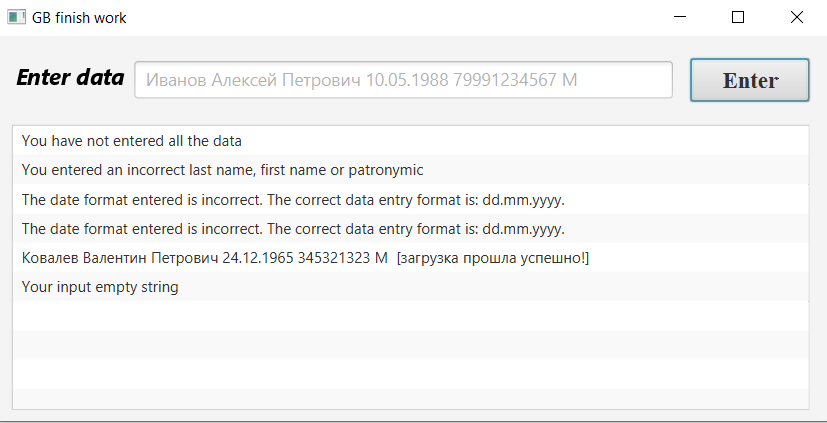
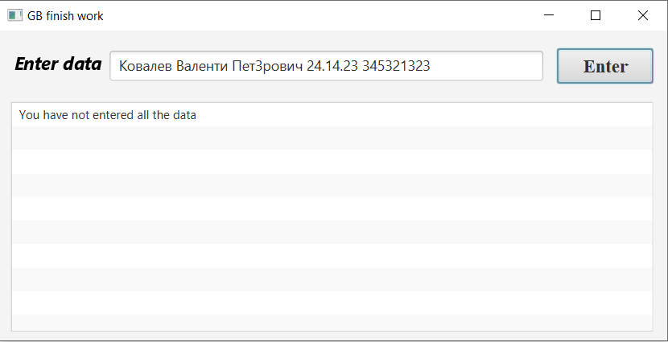
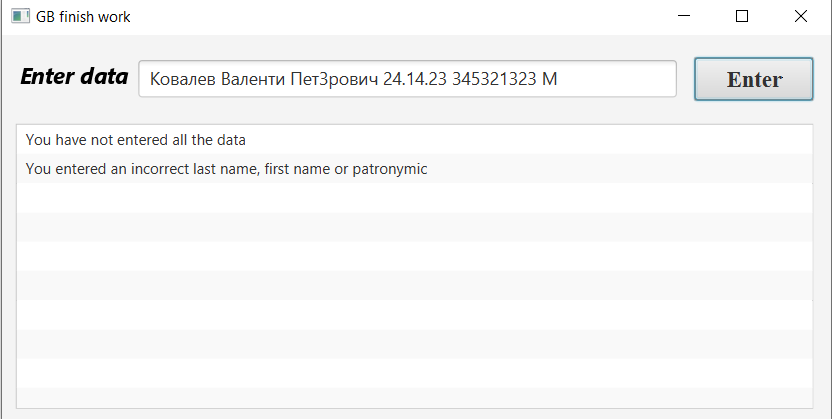
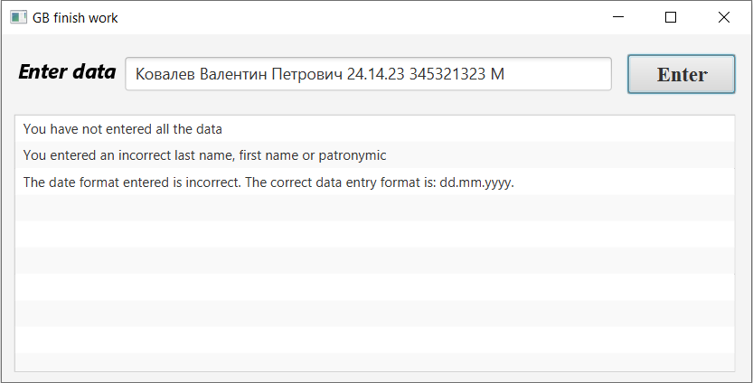
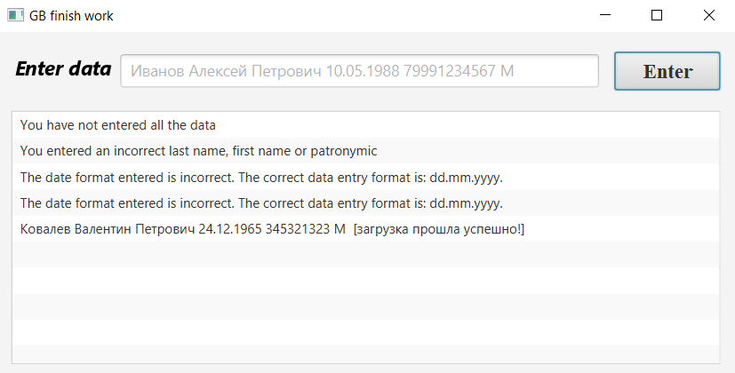

# Исключения в програмировании и их обработка.
    
## Содержание
1.[ Постановка задачи.](#topic1)

2.[ Алгоритм программы](#topic2)

3.[ Графический интерфейс пользователя](#topic3)

4.[ Примеры работы программы](#topic4)

## Постановка задачи 

Напишите приложение, которое будет запрашивать у пользователя следующие данные в произвольном порядке, разделенные пробелом:
Фамилия Имя Отчество датарождения номертелефона пол

Форматы данных:

 + фамилия, имя, отчество - строки
 + дата_рождения - строка формата dd.mm.yyyy
 + номер_телефона - целое беззнаковое число без форматирования
 + пол - символ латиницей f или m.
Приложение должно проверить введенные данные по количеству. Если количество не совпадает с требуемым, вернуть код ошибки, обработать его и показать пользователю сообщение, что он ввел меньше и больше данных, чем требуется.

Приложение должно попытаться распарсить полученные значения и выделить из них требуемые параметры. Если форматы данных не совпадают, нужно бросить исключение, соответствующее типу проблемы. Можно использовать встроенные типы java и создать свои. Исключение должно быть корректно обработано, пользователю выведено сообщение с информацией, что именно неверно.

Если всё введено и обработано верно, должен создаться файл с названием, равным фамилии, в него в одну строку должны записаться полученные данные, вида:
<Фамилия><Имя><Отчество><датарождения><номертелефона><пол>

Однофамильцы должны записаться в один и тот же файл, в отдельные строки.

Не забудьте закрыть соединение с файлом.

При возникновении проблемы с чтением-записью в файл, исключение должно быть корректно обработано, пользователь должен увидеть стектрейс ошибки.

## Алгоритм программы 

Реализация приложения с применением JavaFX. Управление проектом - Maven.
При вводе строки пользователем проводится проверка на соответствие количества переданных параметров количеству требуемых данных. После проверки соответствия, каждый параметр проверяется на соответствие какому-либо из форматов.
При несоответствии какого-то параметра, пользователю выводится информация об Exception и просит исправить параметр.   
Приложение обрабатывает IOExceptions. Информация о данных исключениях отображается в поле лога ошибок.
Распознанная информация сохраняется в текстовые файлы.

## Пользовательский интерфейс 

## Примеры работы программы 

